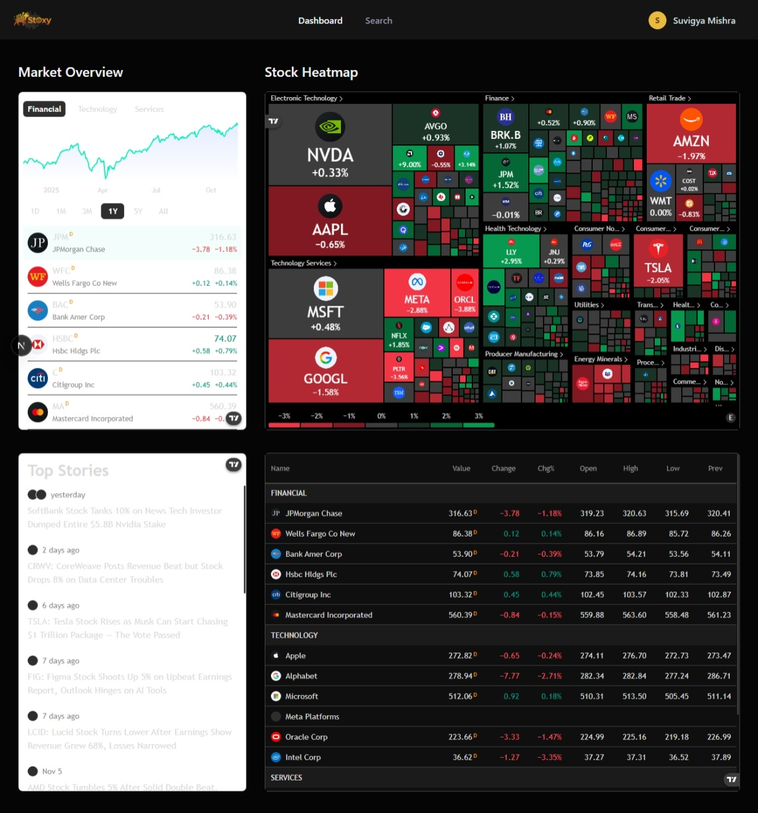

# 📈 Stoxy – Smart Stock Watchlist & Market Dashboard

A production-ready, full-stack stock market dashboard built with **Next.js 15**, **React 19**, **TypeScript**, and **Tailwind CSS**. Track stocks, build personalized watchlists, and get real-time market insights with a lightning-fast, optimized UI.

> **Built for traders and investors who demand speed, precision, and an exceptional user experience.**



[](https://nextjs.org/)
[](https://react.dev/)
[](https://www.typescriptlang.org/)
[](https://www.mongodb.com/)
[](https://tailwindcss.com/)
[](./LICENSE)

---

## ✨ Key Features

### 📌 **Smart Watchlist Management**

- Add/remove stocks with instant optimistic UI updates
- Persistent MongoDB storage with one-click access
- Real-time watchlist sync across all pages & components

### 📊 **Performance-Optimized Charts**

- **Lightweight sparklines** for instant visual feedback
- **Lazy-loaded TradingView** embeds on hover (faster initial load)
- **Batch quote endpoint** reduces API calls and improves response time

### 🔍 **Lightning-Fast Search**

- Debounced stock search with real-time autocomplete
- Watchlist membership status enriched inline
- Server-side and client-side optimizations for responsiveness

### 💼 **Live Market Data**

- Real-time quotes and price movements (Finnhub)
- Market overview, heatmaps, and company profiles (TradingView)
- Intraday candlestick charts and technical analysis widgets

### � **Automated Market Insights**

- **Daily AI summaries** generated via Inngest background jobs
- Personalized email digests with watchlist performance & market news
- Scheduled jobs run reliably at scale without manual intervention

### �🔐 **Production-Grade Authentication**

- Secure session-based auth with better-auth v1
- Email verification & profile management
- Protected API routes and server actions

### 🎨 **Modern, Polished UI/UX**

- Beautiful gradient hero with animated CTA buttons
- Interactive feature cards and testimonial sections
- Smooth hover effects, transitions, and responsive design
- Mobile-first approach with adaptive layouts

### ⚡ **Developer Experience**

- TypeScript strict mode for type safety
- Turbopack for blazing-fast builds
- Server components for optimal performance
- Comprehensive error handling & logging

---

## 🏗️ Tech Stack

| Layer              | Technologies                                                                |
| ------------------ | --------------------------------------------------------------------------- |
| **Frontend**       | Next.js 15 (App Router), React 19, TypeScript, Tailwind CSS 4               |
| **Backend**        | Next.js API Routes, Server Actions, Middleware                              |
| **Database**       | MongoDB, Mongoose (v8)                                                      |
| **Authentication** | better-auth v1 (session-based)                                              |
| **UI Components**  | Radix UI, Lucide Icons, cmdk (command palette)                              |
| **External APIs**  | Finnhub (quotes, profiles), TradingView (charts), Inngest (background jobs) |
| **Email**          | Nodemailer with custom HTML templates                                       |
| **DevOps**         | Vercel deployment, Docker support                                           |
| **Dev Tools**      | ESLint, TypeScript, Turbopack                                               |

---

## 🎯 Architecture Overview

```
stoxy/
├── app/
│   ├── (auth)/                        # Auth layout (sign-in, sign-up)
│   ├── (root)/                        # Main app layout
│   │   ├── page.tsx                   # Landing page / Dashboard
│   │   ├── stocks/[symbol]/page.tsx   # Stock detail page
│   │   └── watchlist/page.tsx         # Watchlist table & management
│   └── api/
│       ├── watchlist/route.ts         # Watchlist CRUD operations
│       ├── finnhub/
│       │   ├── quote/route.ts         # Single quote proxy
│       │   └── quotes/route.ts        # Batch quotes endpoint (optimized)
│       └── inngest/route.ts           # Background job handler
├── components/
│   ├── Header.tsx                     # Sticky header with logo & nav
│   ├── SearchCommand.tsx              # Command palette (client-enriched watchlist)
│   ├── WatchlistButton.tsx            # Optimistic add/remove toggle
│   ├── StockWatchlistButton.tsx       # Client-side membership checker
│   ├── WatchlistTable.tsx             # Watchlist UI with sparklines & lazy charts
│   ├── LazyTradingView.tsx            # Lazy-load strategy for TradingView
│   ├── Sparkline.tsx                  # Lightweight SVG sparkline
│   └── ui/                            # Radix UI components (dialog, dropdown, etc.)
├── lib/
│   ├── actions/                       # Server actions (search, auth, watchlist)
│   ├── better-auth/                   # Auth configuration
│   ├── inngest/                       # Background job definitions
│   ├── nodemailer/                    # Email templates & transport
│   └── utils/                         # Helpers & utilities
├── database/
│   ├── mongoose.ts                    # MongoDB connection pool
│   └── models/watchlist.model.ts      # Mongoose schema
├── types/global.d.ts                  # Global TypeScript definitions
└── middleware/index.ts                # Auth & request middleware
```

### Key Design Patterns

1. **Server Components + Client Islands** – Maximize performance, use client components only when interactivity is needed
2. **Optimistic UI Updates** – Instant feedback on actions; rollback on error
3. **Batch API Requests** – Reduce network overhead with single multi-stock quote fetch
4. **Lazy Loading** – Defer heavy embeds (TradingView) until user interaction
5. **State Synchronization** – Client-side Set ensures consistent watchlist membership across UI

---

## 🚀 Getting Started

### Prerequisites

- **Node.js** 18.17+ (LTS recommended)
- **npm** 9+ or **yarn** 4+
- **MongoDB Atlas** account (free tier available)
- **Finnhub API Key** (free tier at [finnhub.io](https://finnhub.io))

### Installation

**1. Clone and setup**

```bash
git clone https://github.com/Crazyhaller/stoxy.git
cd stoxy
npm install
```

**2. Configure environment**
Create `.env.local`:

```env
# Database
MONGODB_URI=mongodb+srv://<user>:<password>@cluster.mongodb.net/stoxy

# Authentication
BETTER_AUTH_SECRET=your-random-secret-key-here
BETTER_AUTH_URL=http://localhost:3000

# APIs
FINNHUB_API_KEY=your-finnhub-api-key
NEXT_PUBLIC_TRADINGVIEW_KEY=your-tradingview-key

# Email (optional)
EMAIL_USER=your-email@gmail.com
EMAIL_PASSWORD=your-app-specific-password
EMAIL_FROM=noreply@stoxy.com

# Inngest (optional, for background jobs)
INNGEST_EVENT_KEY=your-event-key
INNGEST_API_KEY=your-api-key
```

**3. Run development server**

```bash
npm run dev
```

Visit [http://localhost:3000](http://localhost:3000)

**4. Build for production**

```bash
npm run build
npm start
```

---

## 📖 API Endpoints

### Watchlist CRUD

**`GET /api/watchlist`** – Fetch user's watchlist

```json
{
  "items": [
    { "symbol": "AAPL", "company": "Apple Inc." },
    { "symbol": "TSLA", "company": "Tesla Inc." }
  ]
}
```

**`POST /api/watchlist`** – Add stock

```json
{ "symbol": "AAPL", "company": "Apple Inc." }
```

**`DELETE /api/watchlist`** – Remove stock

```json
{ "symbol": "AAPL" }
```

### Market Data (Finnhub Proxy)

**`GET /api/finnhub/quote?symbol=AAPL`** – Single quote (cached 60s)

**`POST /api/finnhub/quotes`** – Batch quotes (optimized)

```json
{
  "symbols": ["AAPL", "TSLA", "MSFT"]
}
```

Response:

```json
{
  "quotes": [
    { "symbol": "AAPL", "price": 150.25, "changePercent": 1.23 },
    { "symbol": "TSLA", "price": 242.5, "changePercent": -0.45 }
  ]
}
```

---

## 🔬 Performance Optimizations

### 1. **Batch Quote Endpoint**

Reduces N API calls to 1, significantly improving watchlist load time.

### 2. **Lazy-Loaded Charts**

Sparklines render instantly; TradingView embeds load on hover.

### 3. **Server-Side Prefetch**

Watchlist page fetches data server-side for faster first paint.

### 4. **Client-Side Membership Checks**

Single `/api/watchlist` fetch per session; O(1) lookups via `Set<string>`.

### 5. **Turbopack Builds**

Next.js Turbopack engine for 10x faster dev builds & HMR.

### 6. **Revalidation Strategy**

Finnhub endpoints cached with `s-maxage=60, stale-while-revalidate=3600`.

---

## 🔄 Background Jobs with Inngest

Stoxy leverages **Inngest** for reliable, scalable background job processing:

### **Daily Market Summaries**

- Scheduled job runs daily at 9:00 AM ET
- Fetches market data, watchlist stocks, and top news
- Generates personalized AI-powered summaries via Gemini API
- Sends rich HTML email with market insights & watchlist updates

### **Email Notifications**

- Real-time price alerts for watchlist stocks
- Market trend digests with key movers
- Portfolio performance updates
- News headlines relevant to user's holdings

### **Implementation**

```typescript
// lib/inngest/functions.ts
export const dailySummary = inngest.createFunction(
  { id: 'daily-market-summary' },
  { cron: '0 9 * * *' }, // 9 AM daily
  async ({ step }) => {
    const users = await step.run('fetch-users', async () => {
      return db.collection('user').find().toArray()
    })

    for (const user of users) {
      await step.run(`summary-${user.id}`, async () => {
        const watchlist = await getWatchlistByUserId(user.id)
        const quotes = await fetchBatchQuotes(watchlist.map((w) => w.symbol))
        const summary = await generateSummary(quotes, user.preferences)
        await sendEmail(user.email, summary)
      })
    }
  }
)
```

### **Key Features**

- ✅ **Reliability** – Guaranteed execution with automatic retries
- ✅ **Scalability** – Handle millions of jobs without infrastructure overhead
- ✅ **Visibility** – Real-time job monitoring & logs in Inngest dashboard
- ✅ **Flexibility** – Cron jobs, event-driven, or manual triggers
- ✅ **Error Handling** – Automatic backoff & dead-letter queues

### **Configuration**

```env
# .env.local
INNGEST_EVENT_KEY=your-event-key
INNGEST_API_KEY=your-api-key
```

Visit [Inngest Dashboard](https://app.inngest.com) to monitor job runs and performance.

---

## 🔐 Security Best Practices

✅ **Session-based Auth** – Secure HTTP-only cookies via better-auth  
✅ **Environment Variables** – All secrets stored in `.env.local` (never committed)  
✅ **TypeScript Strict Mode** – Compile-time type checking  
✅ **Input Validation** – Server actions validate all incoming data  
✅ **Protected API Routes** – Middleware ensures session authentication  
✅ **CORS Headers** – Configured for secure cross-origin requests

---

## 📦 Database Schema

### Watchlist Model

```typescript
{
  userId: string;          // Mongoose user ID
  symbol: string;          // Stock symbol (uppercase)
  company?: string;        // Company name
  createdAt: Date;
  updatedAt: Date;
  // Unique compound index: [userId, symbol]
}
```

### User Model (via better-auth)

```typescript
{
  id: string;
  email: string;
  name?: string;
  image?: string;
  emailVerified: boolean;
  createdAt: Date;
}
```

---

## 🎨 UI/UX Highlights

- **Modern Hero Section** – Eye-catching headline, CTA buttons, live demo preview
- **Feature Cards Grid** – Watchlists, Sparklines, Alerts showcase
- **Interactive Testimonials** – Real user feedback & 5-star rating
- **Smooth Animations** – Hover scales (1.01), shadow lift, color transitions
- **Responsive Design** – Desktop-first with mobile optimizations
- **Accessible** – ARIA labels, semantic HTML, focus states

---

## 🚀 Deployment

### Vercel (Recommended)

1. **Push to GitHub**

   ```bash
   git push origin main
   ```

2. **Connect to Vercel**

   - Visit [vercel.com](https://vercel.com)
   - Import your GitHub repository
   - Add environment variables from `.env.local`
   - Deploy

3. **Custom Domain** (optional)
   - Go to project settings → Domains
   - Add your custom domain

### Docker

```dockerfile
FROM node:18-alpine AS builder
WORKDIR /app
COPY . .
RUN npm ci && npm run build

FROM node:18-alpine
WORKDIR /app
COPY --from=builder /app/.next ./.next
COPY --from=builder /app/package*.json ./
RUN npm ci --omit=dev
EXPOSE 3000
CMD ["npm", "start"]
```

Build and run:

```bash
docker build -t stoxy .
docker run -p 3000:3000 --env-file .env.local stoxy
```

---

## 📝 Development

### Running Type Check

```bash
npx tsc --noEmit
```

### Linting

```bash
npm run lint
```

### Code Organization

- **Components** are in `components/` with clear responsibility
- **Server Actions** handle data fetching in `lib/actions/`
- **API Routes** in `app/api/` for REST endpoints
- **Database** models in `database/models/`

---

## 🤝 Contributing

We welcome contributions! Here's how:

1. **Fork the repo** on GitHub
2. **Create a feature branch**
   ```bash
   git checkout -b feature/awesome-feature
   ```
3. **Make changes** and test locally
   ```bash
   npm run dev
   ```
4. **Commit with a clear message**
   ```bash
   git commit -m "feat: add awesome feature"
   ```
5. **Push and create a Pull Request**

### Code Standards

- Follow existing code style (TypeScript strict, Tailwind classes)
- Write clear commit messages (feat:, fix:, refactor:, etc.)
- Test changes locally before submitting PR
- Update README if adding major features

---

## 🗺️ Roadmap

- [ ] Real-time Price Alerts (email/SMS on thresholds)
- [ ] Advanced Charting (custom indicators, annotations)
- [ ] Social Features (share watchlists, follow traders)
- [ ] Portfolio Tracking (holdings & P&L calculation)
- [ ] Mobile App (iOS/Android with React Native)
- [ ] AI Stock Recommendations (ML-powered insights)
- [ ] Dark Mode Toggle (theme persistence)
- [ ] Watchlist Collaboration (invite friends to shared lists)

---

## 📚 Additional Resources

- [Next.js Documentation](https://nextjs.org/docs)
- [TypeScript Handbook](https://www.typescriptlang.org/docs/)
- [Tailwind CSS Docs](https://tailwindcss.com/docs)
- [MongoDB Atlas](https://www.mongodb.com/cloud/atlas)
- [Finnhub API](https://finnhub.io/docs/api)
- [TradingView Widgets](https://www.tradingview.com/widget/)

---

## 🙋 Support

- 🐛 **Found a bug?** Open an [Issue](https://github.com/Crazyhaller/stoxy/issues)
- 💡 **Have an idea?** Start a [Discussion](https://github.com/Crazyhaller/stoxy/discussions)
- 📧 **Questions?** Reach out via email or GitHub

---

## 👨‍💻 Author & Maintainer

**Developed by:** [Crazyhaller](https://github.com/Crazyhaller)  
**Full-Stack Developer** | Next.js, React, TypeScript Enthusiast

---

## 🙏 Acknowledgments

Special thanks to:

- [Next.js](https://nextjs.org/) – Amazing React framework
- [Radix UI](https://www.radix-ui.com/) – Unstyled, accessible components
- [Tailwind CSS](https://tailwindcss.com/) – Utility-first CSS
- [Finnhub](https://finnhub.io) – Free stock market data
- [TradingView](https://www.tradingview.com/) – Professional charting widgets
- [better-auth](https://www.better-auth.com/) – Simple, modern auth
- [Inngest](https://www.inngest.com/) – Reliable background job processing
- [MongoDB](https://www.mongodb.com/) – Flexible NoSQL database
- [Nodemailer](https://nodemailer.com/) – Email delivery service

---

<div align="center">

**Made with ❤️ | Stoxy v1.0.0**

[⭐ Star us on GitHub](https://github.com/Crazyhaller/stoxy) if you find this project useful!

</div>
